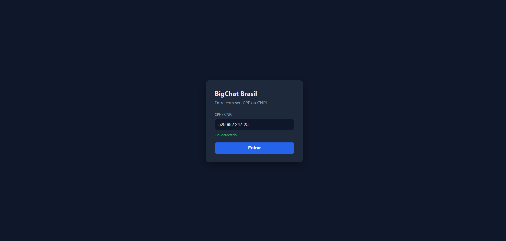
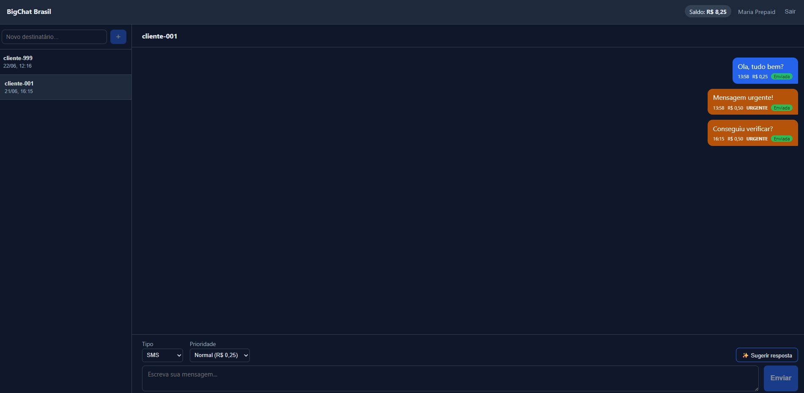
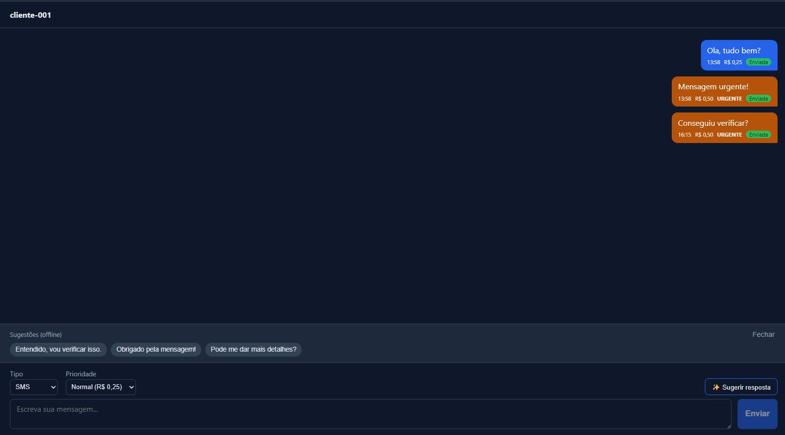
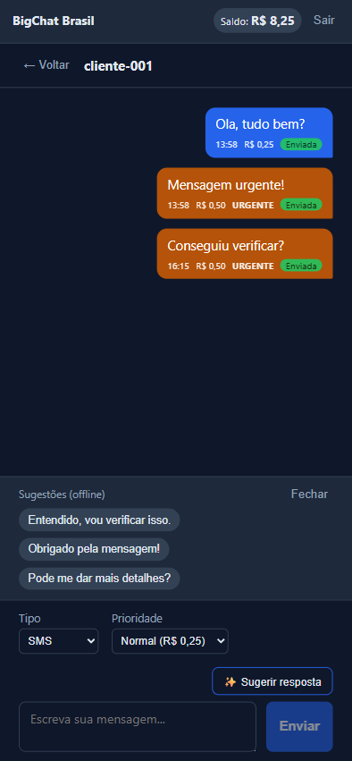

# BigChat Brasil (BCB)

Plataforma de chat entre empresas e seus clientes finais: autenticação por CPF/CNPJ,
envio de mensagens com **fila priorizada** (normal/urgente), **cobrança pré-pago/pós-pago**
e interface de chat responsiva — com **sugestão de resposta por IA** (Claude) como diferencial.

---

## Stack

| Camada | Tecnologias |
|--------|-------------|
| Backend | Java 17, Spring Boot 3.3, Spring Data JPA, Spring Security (JWT), Flyway, springdoc-openapi |
| Frontend | React 18, TypeScript, Vite, React Router, Axios |
| Banco | PostgreSQL 16 |
| Testes | JUnit 5 + Mockito (back), Vitest + Testing Library (front) |
| Infra | Docker + Docker Compose (db + api + web via nginx) |
| IA | Anthropic Claude (`claude-haiku-4-5`) com fallback |

---

## Interface

| Login (validação CPF/CNPJ) | Chat (status + cobrança) |
|----------------------------|--------------------------|
|  |  |

| Sugestão de resposta por IA | Layout responsivo (mobile) |
|-----------------------------|----------------------------|
|  |  |

> Mensagens urgentes aparecem destacadas (laranja) com a tag `URGENTE`; cada bolha mostra
> horário, custo e status (`Enviada`). O badge no topo reflete saldo (pré-pago) ou limite
> restante (pós-pago). As sugestões de IA caem em modo `(offline)` quando não há `ANTHROPIC_API_KEY`.

---

## Como rodar

### Com Docker (recomendado)

```bash
cp .env.example .env        # ajuste se quiser (ANTHROPIC_API_KEY é opcional)
docker compose up --build
```

- Frontend: http://localhost:5173
- API + Swagger: http://localhost:8080/swagger-ui.html
- O nginx do container web faz proxy das rotas da API, então front e back ficam na mesma origem.

### Local (sem Docker)

Backend (precisa de um PostgreSQL na 5432 com banco/role `bigchat`):

```bash
cd api
DATABASE_URL=jdbc:postgresql://localhost:5432/bigchat ./mvnw spring-boot:run
```

Frontend (proxy de dev do Vite aponta para a API em :8080):

```bash
cd web
npm install
npm run dev
```

### Clientes de demonstração (seed)

A migração `V2__seed.sql` cria clientes para login imediato:

| Documento | Tipo | Plano | Detalhe |
|-----------|------|-------|---------|
| `52998224725` | CPF | Pré-pago | saldo R$ 10,00 |
| `11222333000181` | CNPJ | Pós-pago | limite R$ 50,00 |
| `11144477735` | CPF | Pré-pago (admin) | saldo R$ 100,00 |

Login: informe o documento na tela inicial (a UI detecta CPF/CNPJ e valida os dígitos).

---

## Arquitetura

**Backend — Clean Architecture pragmática, organizada por feature** (`client`, `auth`,
`messaging`, `conversation`, `billing`, `ai` + `shared`). Cada feature tem `domain` /
`application` / `infrastructure` / `web`. Controllers finos, regra de negócio em
`application`, direção de dependência limpa sem uma interface de porta por repositório
(uso interface explícita só onde há variação real: `MessageQueue` e `ClaudeClient`).

**Frontend — feature-folder + camada de serviço tipada.** Estado de sessão e dados via
Context API + hooks customizados sobre Axios, com estados `loading/error/success`
explícitos. Sem Redux/React Query.

---

## Decisões técnicas e tradeoffs

- **Fila prioritária + processamento síncrono.** `POST /messages` apenas **enfileira**
  (`QUEUED`); o **dreno** move `QUEUED → PROCESSING → SENT` em ordem de prioridade
  (urgente antes de normal, FIFO no empate) na própria thread do request — **sem broker
  nem worker**. No fluxo normal, ao final do envio há um auto-dreno **escopado ao próprio
  cliente**; o dreno **global** fica em `POST /messages/process` (**admin-only**), útil para
  demonstrar a prioridade com backlog acumulado.
  - *Honestidade sobre observabilidade:* num sistema síncrono single-user o backlog é raso,
    então a ordenação por prioridade raramente é observável ponta-a-ponta em runtime. A
    corretude é garantida por **teste unitário direto do dreno com backlog pré-populado**, e
    o cenário real de backlog é a **reidratação de `QUEUED` após restart** (`ApplicationRunner`).
- **Cobrança transacional com optimistic locking.** `BillingService` é `@Transactional`; o
  `Client` usa `@Version` com retry curto. Garante que o saldo nunca fica negativo sem o
  custo (e a flakiness) de lock pessimista / teste multi-thread.
- **Dinheiro em `BigDecimal`** (escala 2, `HALF_UP`): R$ 0,25 normal / R$ 0,50 urgente
  (o preço vive no enum `MessagePriority`).
- **JWT a partir do documentId**; a flag `active` do cliente é checada no banco a cada
  envio (um token emitido antes da inativação não envia).
- **IA — sugestão de resposta.** `POST /conversations/{id}/ai-suggestions` gera 2–3
  respostas a partir do histórico via Claude. **Sem `ANTHROPIC_API_KEY`** (ou em
  erro/timeout) retorna 200 com `fallback: true` e sugestões estáticas — **nunca quebra**.
- **CORS:** em produção o nginx serve o SPA e faz proxy da API (mesma origem); em dev o
  proxy do Vite cumpre o mesmo papel. O backend também expõe CORS configurável
  (`CORS_ALLOWED_ORIGINS`) como rede de segurança.

---

## Endpoints principais

| Método | Rota | Auth | Descrição |
|--------|------|------|-----------|
| POST | `/auth` | — | Autentica por documentId/type, emite JWT |
| GET/POST/PUT/DELETE | `/clients` | Bearer | CRUD de clientes |
| PATCH | `/clients/{id}/balance` | Bearer | Ajuste de saldo/limite (grava transação) |
| PATCH | `/clients/{id}/plan` | Bearer | Conversão de plano |
| GET | `/clients/{id}/transactions` | Bearer | Histórico de transações |
| POST | `/messages` | Bearer | Envia (valida, cobra, enfileira, auto-dreno do cliente) |
| POST | `/messages/process` | Bearer **admin** | Dreno global por prioridade (demo) |
| GET | `/conversations` | Bearer | Lista conversas |
| GET | `/conversations/{id}/messages` | Bearer | Histórico paginado da conversa |
| POST | `/conversations/{id}/ai-suggestions` | Bearer | Sugestões de resposta via IA |

Documentação interativa completa no **Swagger UI** (`/swagger-ui.html`), com botão
**Authorize** para o token Bearer.

---

## Testes

```bash
cd api && ./mvnw test     # backend (JUnit 5 + Mockito, H2 em memória)
cd web && npm run test     # frontend (Vitest + Testing Library)
```

Cobertura inclui validação CPF/CNPJ, emissão/validação de JWT, ordenação da fila,
cobrança pré/pós-pago e saldo insuficiente, ajuste admin, fallback de IA, golden path de
integração (back) e validação de documento, login, envio de mensagem e badge de saldo (front).

---

## Limitações e escopo (YAGNI consciente)

- **Entrega de mensagem é mockada** (mudança de status simulada); sem integração real de
  SMS/WhatsApp. Por consequência, o ciclo é **outbound-only** e os estados alcançáveis são
  `QUEUED → PROCESSING → SENT` (ou `FAILED`); `DELIVERED`/`READ` ficam fora de escopo por
  não haver evento de entrega que os dispare.
- **Sem broker/fila assíncrona** — processamento síncrono é premissa.
- **Sem atualização near-real-time** (polling/WebSocket fora de escopo).
- O `FAILED` é alcançável de forma determinística (recipient sentinela inválido); no mock
  **não há estorno** em falha — decisão consciente, documentada aqui.
